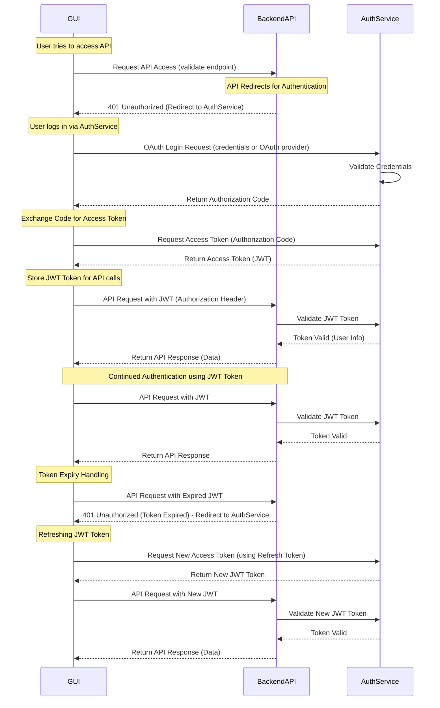

---
date:
  created: 2025-03-24
authors:
  - rogerk
categories:
  - UML
---

# OAuth Flow: GUI, Backend API, and AuthService

This document outlines the **OAuth authentication flow** between a **GUI (client application)**, a **Backend API**, and an **AuthService**. The flow covers the following key aspects:

- **Initial API access attempt**
- **Redirection to authentication via AuthService**
- **JWT token issuance & API authorization**
- **Handling token expiration & refresh**

<!-- more -->

### Definitions

I'll use a few terms here that I'll define for most freshers to understand.  It may sound a bit juvenile but I don't want to lose anyone here:

>>> **OAuth** is like a permission slip for apps and websites.>>> Imagine you go to the library and want to borrow a book, but you forgot your library card. Instead of making a new one the librarian lets you log in with your school ID. The school tells the library who you are, and now you can borrow books without making a new account.

OAuth works the same way online. If an app wants to access your info (like your email or photos), it asks a trusted service (like Google or Facebook) for permission. You log in once, approve it, and the app gets a special key to use your info—without ever needing your password. This keeps your data safe and makes logging in easier! 

>>> **JWT (JSON Web Token)** is like a digital passport for the internet.
>>> It helps websites and apps know who you are without needing you to log in every time. It's your permission slip.  The web service doesn't need to access authentication information on you.

JWT works the same way—when you log in, the website gives you a special token (like a permission slip) that proves you are allowed to access certain things.

This token is a small piece of text with important information inside, like who you are and what you can do. It is safe because it is signed (encrypted), meaning nobody can change it without being caught. Websites and apps use JWTs to keep things fast and secure!  The AuthService knows how to decrypt it so only it can vouch for the user bearing the token the user doesn't have to pass their credentials around to everyone.

## **Sequence Diagram**

Aside from the high-level purpose of the OAuth flow, you may not know the details.  That is why I am discussing it here.  The following is a **UML Sequence Diagram** representing the entire OAuth flow:

## OAuth Flow Walkthrough

### 1. Initial API Request

The GUI attempts to access the Backend API by calling a protected endpoint (e.g., /get_items).
The Backend API detects that there is no valid JWT token and responds with 401 Unauthorized.
The Backend API redirects the GUI to the AuthService for authentication.

### 2. OAuth Authentication & Token Issuance

The GUI redirects the user to the AuthService login page.
The user enters credentials (or logs in via an OAuth provider).
The AuthService validates the credentials and issues an Authorization Code.
The GUI exchanges the Authorization Code for an Access Token (JWT).

### 3. API Access with JWT Token

The GUI stores the JWT for future API requests.
The GUI makes an authenticated API request, including the JWT in the Authorization header.
The Backend API validates the JWT with the AuthService.
If valid, the API processes the request and returns the response.

### 4. Continued Authentication

The GUI continues sending API requests using the same JWT token.
The Backend API validates each request by checking the JWT.

### 5. Token Expiry & Refresh Flow

The JWT eventually expires.  The GUI sends another API request, but the Backend API detects the expired token and responds with 401 Unauthorized. The GUI requests a new JWT using the refresh token from the AuthService.

The AuthService provides a new JWT, which is stored and used for further API requests.

## Conclusion

Hopefully, this helps everyone understand the concepts of web authentication using OAuth.
This authentication model ensures secure API access and session persistence using JWT and refresh tokens, enabling seamless user experiences with automatic token renewal. It supports OAuth providers, username-password authentication, and secure API communication, making it ideal for modern web and mobile applications.