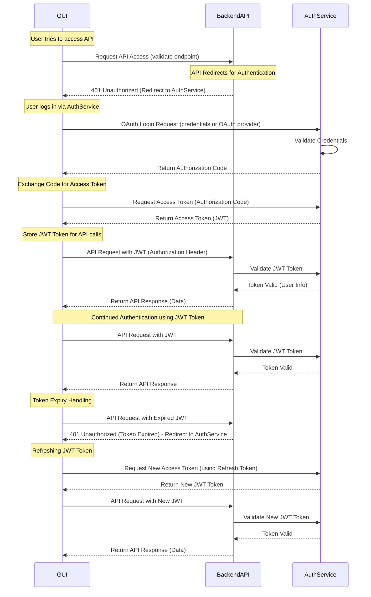

---
date:
  created: 2025-03-24
categories:
  - UML
---

# OAuth Flow: GUI, Backend API, and AuthService

This document outlines the **OAuth authentication flow** between a **GUI (client application)**, a **Backend API**, and an **AuthService**. The flow covers the following key aspects:

- **Initial API access attempt**
- **Redirection to authentication via AuthService**
- **JWT token issuance & API authorization**
- **Handling token expiration & refresh**

<!-- more -->

## **Sequence Diagram**

Below is a **UML Sequence Diagram** representing the entire OAuth flow:

OAuth Flow Walkthrough
1. Initial API Request
The GUI attempts to access the Backend API by calling a protected endpoint (e.g., /get_items).
The Backend API detects that there is no valid JWT token and responds with 401 Unauthorized.
The Backend API redirects the GUI to the AuthService for authentication.
2. OAuth Authentication & Token Issuance
The GUI redirects the user to the AuthService login page.
The user enters credentials (or logs in via an OAuth provider).
The AuthService validates the credentials and issues an Authorization Code.
The GUI exchanges the Authorization Code for an Access Token (JWT).
3. API Access with JWT Token
The GUI stores the JWT for future API requests.
The GUI makes an authenticated API request, including the JWT in the Authorization header.
The Backend API validates the JWT with the AuthService.
If valid, the API processes the request and returns the response.
4. Continued Authentication
The GUI continues sending API requests using the same JWT token.
The Backend API validates each request by checking the JWT.
5. Token Expiry & Refresh Flow
The JWT eventually expires.
The GUI sends another API request, but the Backend API detects the expired token and responds with 401 Unauthorized.
The GUI requests a new JWT using the refresh token from the AuthService.
The AuthService provides a new JWT, which is stored and used for further API requests.
Conclusion
This authentication model ensures secure API access and session persistence using JWT and refresh tokens, enabling seamless user experiences with automatic token renewal. It supports OAuth providers, username-password authentication, and secure API communication, making it ideal for modern web and mobile applications.